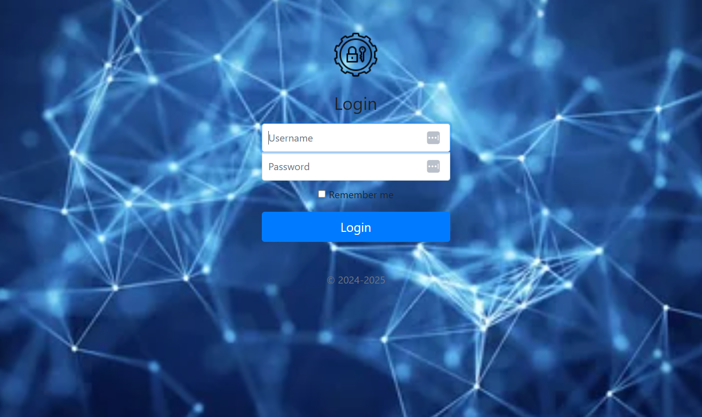
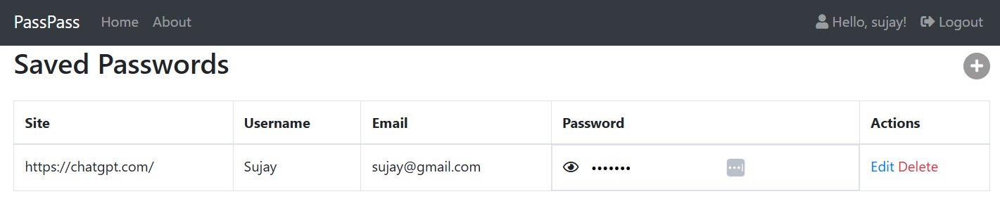
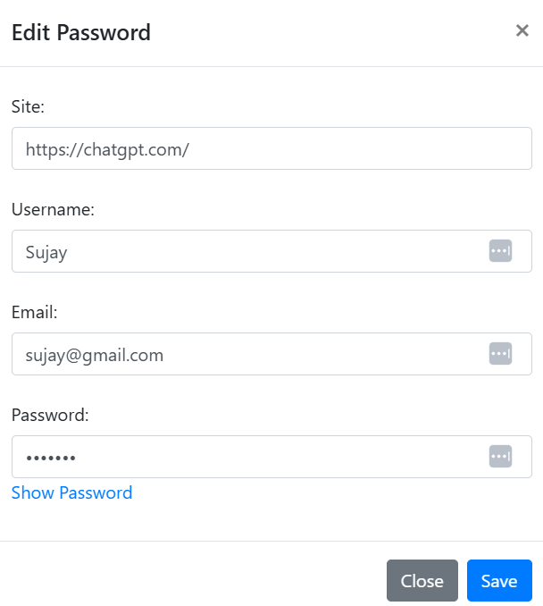
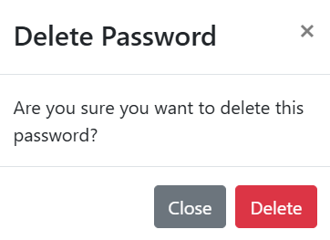

# passpass

passpass, a password manager based upon Django Project with login, one time registration, logout, password saving functionality.

## Project objective
1) Login, registration functionality with default django user model
2) Restriction to views without login
3) One time registration and single user application
4) Using django secure hashing encryption for passwords
5) Password saving, editing and deleting functionality

## How to install?
1) Clone this repo : "https://github.com/SujayKumarMondal/Password_Manager_Django" in your local machine, using `git clone ...`
2) Get inside `passpass` directory
3) Initialize the virtual environment in this directory by `python -m venv .`. Note: Use Python3
4) Then `source bin/activate`
5) `pip install -r requirements.txt`
6) `cd src`
7) `python manage.py runserver`
8) `http://127.0.0.1:8000/`

## Login Details
Currently, a user is on the database. You can delete it with django administration and create new one. The registration is a one time process. The login details is same with the django administration too.

## Use this below command to create super user 
python manage.py createsuperuser

